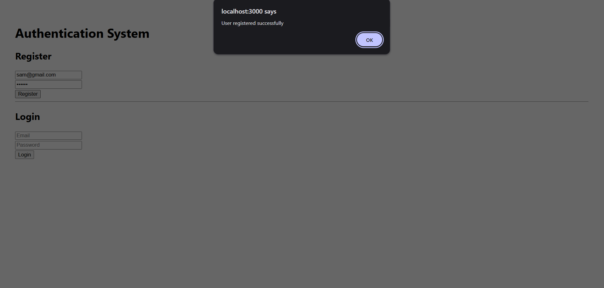
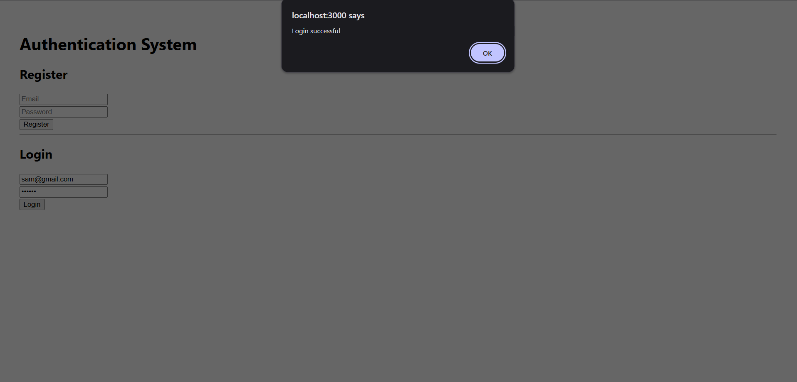
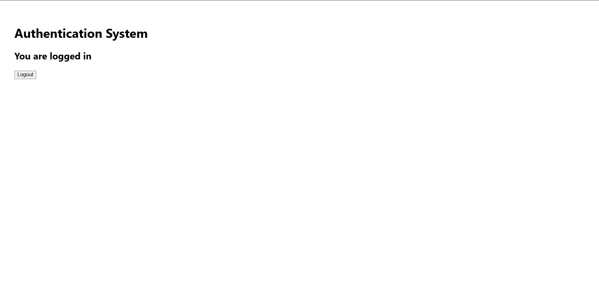
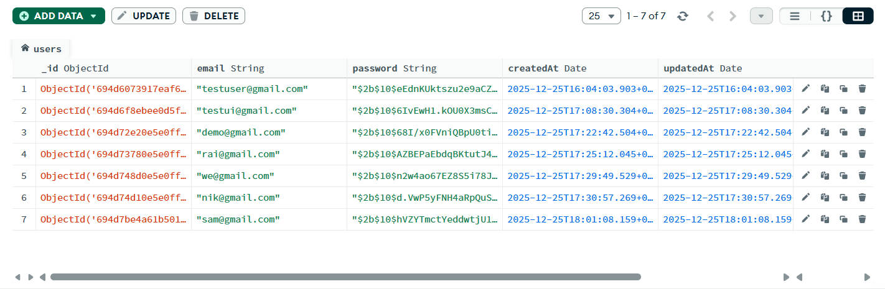

# Authentication System (MERN Stack)

A full-stack authentication system built using the MERN stack.

## Tech Stack
- React
- Node.js
- Express.js
- MongoDB Atlas
- JWT Authentication

## Features
- User Registration
- User Login
- Password Hashing using bcrypt
- JWT-based authentication
- Protected routes
- Logout functionality
- Conditional UI rendering based on auth state

## Screenshots

### Register Page


### Login Page


### Logged-in State


### MongoDB User Data



## Project Structure
AW/
├── backend
├── frontend
├── .gitignore
└── README.md


## How to Run the Project

### Backend
```bash
cd backend
npm install
node server.js

cd frontend
npm install
npm start
